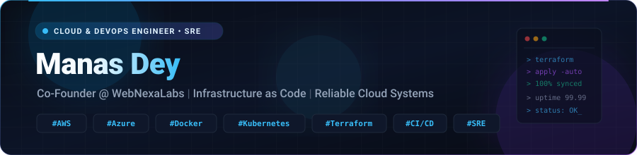

  

  

  
  
  
  

  
  
  
  

---

### 👨‍💻 Executive Summary

I am a **Cloud & DevOps Engineer / Site Reliability Engineer (SRE)** with nearly **3 years of hands-on experience** designing resilient cloud architectures, streamlining CI/CD delivery pipelines, and maintaining high-availability production environments.

- 🚀 **Current**: Co-Founder & Platform Lead at **WebNexaLabs**, engineering scalable cloud backends and AI-driven platforms.
- 🏢 **Previous Experience**: Cloud Support Engineer at **Accenture** & Internal IT Systems at **BYJU’S**.
- 🎓 **Education**: Master of Computer Applications (**MCA**) with specialization in Cloud Systems and Distributed Architectures.
- 💡 **Core Focus**: Infrastructure as Code (IaC), GitOps, microservices orchestration, proactive observability, and zero-downtime deployments.
- ⚡ **Fun Fact**: *The cloud is just someone else’s computer, but automation and SRE discipline make it yours!*

---

### 🛠️ Core Competencies & Tech Stack

<table>
  <tr>
    <td width="28%"><strong>☁️ Cloud & Infrastructure</strong></td>
    <td>
      
      
      
      
      
      
    </td>
  </tr>
  <tr>
    <td width="28%"><strong>⚙️ DevOps, IaC & CI/CD</strong></td>
    <td>
      
      
      
      
      
      
      
    </td>
  </tr>
  <tr>
    <td width="28%"><strong>📊 Observability & Monitoring</strong></td>
    <td>
      
      
      
    </td>
  </tr>
  <tr>
    <td width="28%"><strong>💻 Languages & Scripting</strong></td>
    <td>
      
      
      
      
      
    </td>
  </tr>
  <tr>
    <td width="28%"><strong>🗄️ Databases & Storage</strong></td>
    <td>
      
      
      
      
      
      
    </td>
  </tr>
  <tr>
    <td width="28%"><strong>🚀 Backend & Frameworks</strong></td>
    <td>
      
      
      
      
      
      
    </td>
  </tr>
  <tr>
    <td width="28%"><strong>🛠️ Ecosystem & Tools</strong></td>
    <td>
      
      
      
      
      
    </td>
  </tr>
</table>

---

### 🌟 Featured Projects

<table>
  <tr>
    <td width="50%">
      <h3 align="center"><a href="https://github.com/mannas006/edupapers">📚 EduPapers</a></h3>
      
<strong>AI-Powered Question Paper & Exam Platform</strong>

      
Intelligent PDF processing, automated solution and questionnaire generation using Google Gemini AI, modern Material UI design with scalable cloud storage.

      

        <code>React</code> • <code>Python</code> • <code>Google Gemini AI</code> • <code>Supabase</code> • <code>TypeScript</code>
      

    </td>
    <td width="50%">
      <h3 align="center"><a href="https://github.com/mannas006/StreamFlix">🎬 StreamFlix</a></h3>
      
<strong>High-Performance Media Streaming Engine</strong>

      
Netflix-style streaming architecture engineered with instant playback, live audio transcoding, and robust HTTP byte-range chunk streaming for zero-lag buffer performance.

      

        <code>TypeScript</code> • <code>Node.js</code> • <code>HTTP Streaming</code> • <code>Express</code> • <code>FFmpeg</code>
      

    </td>
  </tr>
  <tr>
    <td width="50%">
      <h3 align="center"><a href="https://github.com/mannas006/Buzzly-Chat">💬 Buzzly-Chat</a></h3>
      
<strong>Real-Time Anonymous Chat Platform</strong>

      
Low-latency peer-matching instant messenger enabling frictionless 1-on-1 socket conversations without mandatory signups, built for real-time throughput.

      

        <code>Node.js</code> • <code>Express</code> • <code>Socket.io</code> • <code>WebSockets</code>
      

    </td>
    <td width="50%">
      <h3 align="center"><a href="https://github.com/mannas006/PixsBliss_Site">🖼️ PixsBliss</a></h3>
      
<strong>Wallpaper & Visual Assets Platform</strong>

      
High-resolution wallpaper curation and distribution platform providing responsive browsing, category indexing, and optimized asset delivery for multiple form factors.

      

        <code>TypeScript</code> • <code>Next.js</code> • <code>Cloudflare CDN</code> • <code>Tailwind</code>
      

    </td>
  </tr>
</table>

---

### 📊 GitHub Activity & Analytics

  

    
    
  

  

    
  

---

  
<em>"Simplicity is prerequisite for reliability."</em> — <strong>Edsger W. Dijkstra</strong>

  

